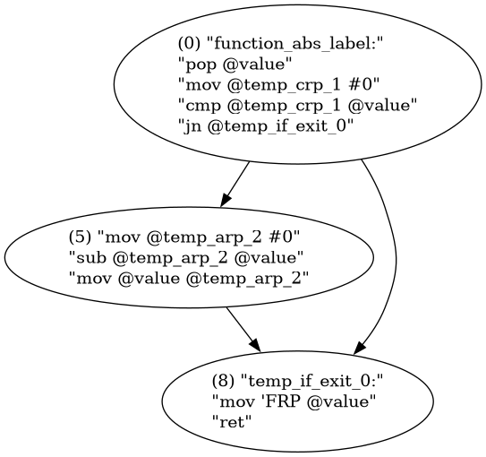

# Information on the AFG compiler
This is a simple compiler, that translates the AFG language into ASMFG, a pseudo-assembly language. The compiler is written in Rust. It is not supposed to be performant, in order to push people towards writing their code in assembly directly.

# Pipeline
1. [Tokenization](#tokenization)
2. [AST Parsing](#ast-parsing)
3. [Semantic Analysis](#semantic-analysis)
4. [Pseudo-assembly generation](#pseudo-assembly-generation)
5. [Basic block identification](#basic-block-identification)
6. [Live variable analysis](#live-variable-analysis)
7. [Register allocation](#register-allocation)
8. [Address resolution](#address-resolution)
9. [Final assembly generation](#final-assembly-generation)

## Tokenization
The tokenization is done using a simple lexer, that reads the input file, splits it into possible tokens by splitting at the following characters: ` (){}\n;`.
The different strings are then matched to the possible tokens, and the tokens are stored in a list.

Here are the possible tokens:

| Token | Value | Description |
|-------|-------|-------------|
| `KEYWORD` | `fn`, `while`, `set`, `if`, `return`, `loop`, `call` | A reserved keyword, indicating a specific code action |
| `OP` | `+`, `-`, `*`, `/`, `%`, `<`, `<=`, `==`, `!=`, `=`, `>=`, `>` | An operator, used for arithmetic or comparison |
| `LPAREN` | / | Opening parenthesis |
| `RPAREN` | / | Closing parenthesis |
| `LBRACE` | / | Opening brace |
| `RBRACE` | / | Closing brace |
| `Comment` | / | A comment, starting with `//` |
| `ENDL` | / | A newline (indicated by either `;` or `\n`) |
| `ID` | A string that represents the name of the variable | An identifier, used for variable names. This consists of every other matches except whitespace which are ignored |

Given the following code:
```
fn abs(value) {
    if value < 0 {
        set value = 0 - value;
    }
    return value;
}
```

the code will be tokenized into the following tokens:

```
KEYWORD = fn
ID = abs
LPAREN
ID = value
RPAREN
LBRACE
ENDL
KEYWORD = if
ID = value
OP = <
ID = 0
LBRACE
ENDL
KEYWORD = set
ID = value
OP = =
ID = 0
OP = -
ID = value
ENDL
ENDL
RBRACE
ENDL
KEYWORD = return
ID = value
ENDL
ENDL
RBRACE
```

> Notice the double `ENDL` token at the end, this is because a `;` is followed by a newline, which is also a token. This is not a problem, as the parser will ignore the `ENDL` token at the end of the file. but this allows for the code to be also be written on a single line `fn id(val) { return val; }`

## AST Parsing
The AST parsing happens once for every function in the code. The tokens are parsed in order, starting with a function. A function has a name, list of parameters and a code block.
The code block simply consists of a list of nodes (in order of appearance in the code). The nodes can be of the following types:

| Node type | information | Description |
|-----------|-------------|-------------|
| `Identifier` | `name`: String | An identifier, used for variable names |
| `Litteral` | value: `i32` | A litteral, used for numbers |
| `Assignment` | lparam: `Node`, rparam: `Node` | An assignment, setting the value of the left parameter to the right parameter |
| `Operation` | lparam: `Node,` rparam: `Node`, operation: `OperationType` | An operation, performing an arithmetic operation on the left and right parameters |
| `Comparison` | lparam: `Node`, rparam: `Node`, comparison: `ComparisonType` | A comparison, comparing the left and right parameters |
| `WhileLoop` | condition: `Node`,  content: `CodeBlock` | A while loop, that runs the content as long as the condition is true |
| `Loop` | content: `CodeBlock` | A loop, that runs the content indefinitely |
| `IfCondition` | condition: `Node`, content: `CodeBlock` | An if condition, that runs the content if the condition is true |
| `FunctionCall` | function_name: `String`, parameters: `CodeBlock` | A function call, calling the function with the given parameters |
| `Return` | value: `Option<String>` | A return statement, returning the value if it is present |

While not explicitly stated here, the `Node` children are mostly limited in their types. For example, the `lparam` and `rparam` of an `Operation` node are always either `Identifier` or `Litteral` nodes.

At this stage, the above code would look something like this:

```
Function: abs
If
 |--Comparison LT
 |   |--ID value
 |   |--LIT 0
Do
 |--Assignment
 |   |--ID value
 |   |--Operation Substraction
 |   |   |--LIT 0
 |   |   |--ID value
Return
 |--ID value
```

## Semantic Analysis
Verifying semantic correctness is done by checking the following:
* Variables are declared before use
* No assignment to a litteral

Since variables are scoped function-wise, the compiler will not check for variable scoping. This means that a variable declared in a loop will be accessible outside of the loop.

## Pseudo-assembly generation
This step produces pseudo assembly code. This is pseudo-code in the sense that it uses labels and named variables, which are not allowed in the final assembly code.

Our `abs` function would look like this:

```
function_abs_label:
	pop @value
	mov @temp_crp_1 #0
	cmp @temp_crp_1 @value
	jn @temp_if_exit_0
	mov @temp_arp_2 #0
	sub @temp_arp_2 @value
	mov @value @temp_arp_2
temp_if_exit_0:
	mov 'FRP @value
	ret
```

> As in the `asmfg` language, literals are prefixed with `#`, registers with `'` and memory addresses with `$`. The `FRP` register is used to store the return value of the function.
> The `@` prefix is used to indicate a temporary variable or a label to jump to. Whether it is a temporary variable or a label is determined by the context.

## Basic block identification

The next step is to isolate basic blocks. A basic block is a sequence of instructions that has a single entry point and a single exit point. This is done by identifying the jump instructions and the labels they point to.
This step is crucial for the next step as is allows to identify the live variables in each basic block, which is necessary for register allocation.


The basic blocks graph for the `abs` function.

## Live variable analysis
In order to determine which variables are live during the program's execution, we need to build a liveness tree.
This tree will associate each instruction with an `undead-out` set, i.e. a set of variable we now are live after this instruction.
For example, the instruction `mov @var_a @var_b` will imply that before this instruction (the previous instruction's undead-out) var_b is live and var_a is not (or at least maybe not).

To do this, we need to iterate in reverse order over the instructions in each block.
